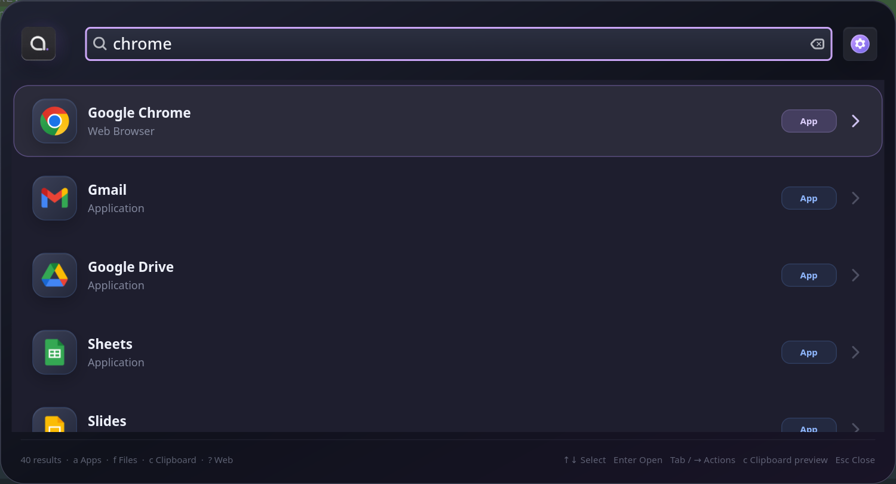

# Alter

[](https://yuukidach.github.io/alter/) [](README.md) [](LICENSE)

Alter 是面向 **Hyprland + Wayland** 的快速启动器，提供应用和文件搜索、剪贴板历史、网页搜索，以及 Quick Links、Workflow、Snippet 等扩展，全部集中在一个 GTK4 浮层中。



## 功能

- 模糊搜索并启动 `.desktop` 应用。
- 使用 `plocate` 搜索文件；没有可用数据库时回退到 `fd`。
- 可选集成 [Clipse](https://github.com/savedra1/clipse)，浏览文本、图片和文件剪贴板历史，支持预览、固定和隐藏。
- 内置计算器，按 Enter 将结果复制到剪贴板。
- 使用 Google、Bing 或 DuckDuckGo 搜索网页。
- 自定义 Quick Links、Workflow 和 Snippet。
- Waybar 托盘图标、明暗主题，以及中英文界面。

## 依赖

Alter 目前面向使用 Hyprland 的 Wayland Linux 桌面。

Arch Linux / EndeavourOS：

```bash
sudo pacman -S --needed base-devel rust gtk4 gtk4-layer-shell \
  plocate fd wl-clipboard curl xdg-utils
```

`plocate`、`fd` 和 Clipse 都是可选依赖。图片和文件剪贴板历史需要 Clipse；没有 Clipse 时，Alter 自带的监听器只保存文本。

## 安装

### AUR

```bash
yay -S alter-launcher
```

### 从源码构建

```bash
cargo build --release
./target/release/alter --daemon
```

## Hyprland 配置

启动一个后台实例，再绑定快捷键：

```ini
exec-once = /path/to/alter --daemon
bind = SUPER, SPACE, exec, /path/to/alter --toggle
bind = SUPER SHIFT, C, exec, /path/to/alter --clipboard
```

执行 `hyprctl reload` 重新加载配置。后台实例默认隐藏，快捷键调用时显示；后续调用会复用同一个窗口。

## 使用

| 输入 | 作用 |
| --- | --- |
| `a query` | 搜索应用 |
| `f query` | 搜索文件 |
| `c query` | 搜索剪贴板历史 |
| `? query` / `web query` | Google 搜索 |
| `g query` / `b query` / `ddg query` | Google / Bing / DuckDuckGo |
| `settings` 或 `Ctrl+,` | 打开设置 |

常用按键：

- `Enter`：启动、打开或复制当前结果
- `↑` / `↓`：移动选择
- `Tab` / `→`：打开应用、文件或 Workflow 的操作面板
- `←` / `Backspace`：返回搜索页
- `Ctrl+Shift+P`：固定或取消固定剪贴板记录
- `Delete`：在 Alter 中隐藏剪贴板记录
- `Esc`：隐藏浮层

命令行模式：

```text
alter --daemon       后台启动并常驻托盘
alter --toggle       切换已有实例的浮层
alter --clipboard    直接进入剪贴板搜索
alter --capture      从 stdin 读取一条文本并写入历史
```

## 配置文件

大多数选项可在 **设置** 中修改并自动保存。主要文件如下：

| 路径 | 用途 |
| --- | --- |
| `~/.config/alter/settings.conf` | 功能开关、主题、语言、保留期限 |
| `~/.config/alter/quick-links.json` | “关键词 + URL”快捷链接 |
| `~/.config/alter/web-searches.json` | 自定义网页搜索模板 |
| `~/.config/alter/workflows/*.json` | 自定义命令和操作 |
| `~/.config/alter/snippets.json` | 使用 `{query}` 的文本模板 |
| `~/.local/share/alter/history.sqlite3` | 剪贴板 metadata 和使用频率 |

所有扩展命令都以 argv 参数数组启动，不经过 shell。请确认自定义命令和 URL 模板来自可信来源。

界面默认跟随系统语言，也可以在设置中手动选择 **English** 或 **简体中文**。

## 剪贴板说明

剪贴板默认保留 30 天，可在设置中调整为 1–3650 天。Alter 会读取 Clipse 的历史文件，但不会改写该文件。剪贴板内容保存在本机，可能包含密码或令牌等敏感文本，请按需清理或暂停剪贴板记录。

## 已知限制

- 当前只适配 Hyprland/Wayland，暂未提供 X11、GNOME 或 KDE 适配。
- 自带剪贴板监听器只记录文本；图片和文件历史需要 Clipse。
- Wayland 不允许应用无条件向其他客户端注入 `Ctrl+V`，因此 Snippet 和剪贴板结果只会写入剪贴板。
- 文件搜索结果取决于 `plocate` 索引是否及时更新。

## 许可证

MIT
